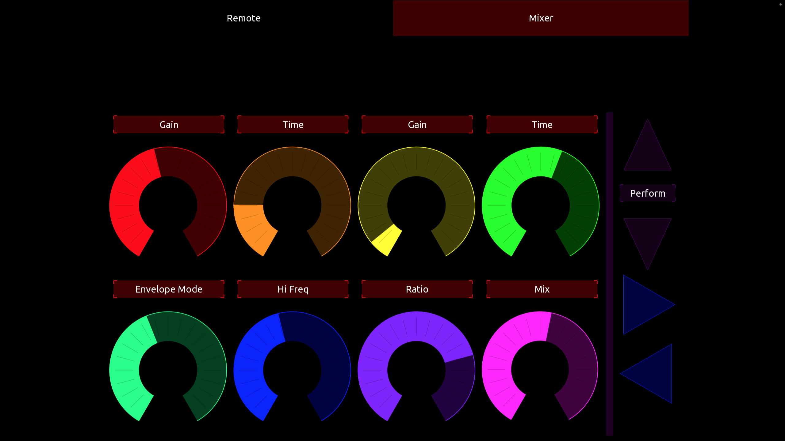
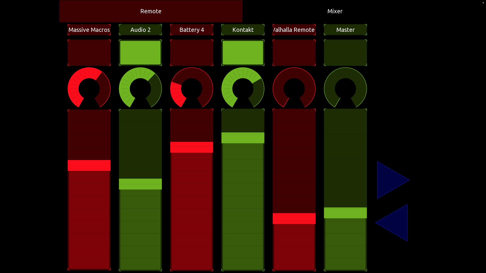

# TouchOSCxBitwig
A little script that makes Bitwig communicate with TouchOSC and vis versa.
This is a hobby project, so it may or may not recieve updates.
The Script was tested in Bitwig 4 and 5.

# Update 0.4
The Buttons that previously muted and unmuted the tracks now arm and disarm.
This may not make a lot of sense at first glance, but I myself use the script in live performances which always include audio input from synthesizers, therefore I use arming to enable and disable the track. 
Muting can be achieved by just pulling the fader down anyways.

And another addition: the mixer now includes a rotary slider for the first send of each track.

# Features
- All remote controls of the currently selected Bitwig device are automatically mapped to the TouchOSC knobs
- Names of all parameters and currently selected track are displayed
- Change remote pages via TouchOSC
- Change selected device
- No extra software or hardware required

# Installation
- Install Bitwig ... duh... i mean...why else would you want that script.
- Install TouchOSC on the hardware device of your liking. I tested it on an iPad, works great
- Connect your hardware device such that it is recognized as a Midi device (see steps below)
- Put the TouchOSC Layout onto your hardware device. (For example via AirDrop or by connecting the TouchOSC Editor from your external device with the TouchOSC Editor on your computer as described here: https://hexler.net/touchosc/manual/editor-network)
- Create a folder in your Bitwig Controller Scripts folder (for Mac thats ~/Documents/Bitwig Studio/Controller Scripts) called TouchOSC
- Copy the script TouchOSC.control.js into that folder
- In Bitwig: open the control preferences and add a new controller (generic->TouchOSC) and select the connected TouchOSC device as Input.
- ???
- Profit

# iOS as MIDI-Device on Mac
Tested using iPad and mac
- Connect the device to your computer via USB
- On the mac, open Audio-Midi-Setup
- Your device will be listed on the left, click on Activate. You have to do this step every time, no idea why, if someone knows how to NOT have to do that, please tell me.
- In TouchOSC on the device open the connections tab. (the button with the chain symbol)
- Go to MIDI tab
- Enable Connection 1 and browse for the Host (mine is called "IDAM MIDI Host", dont know if this is default). This step only has to be done once (except if you change it of course)
- Click done

# Customize
## Controls
Here is what you need to know for customization:
When adding the script, Bitwig listens on Midi Channel 1 for the CCs 0 to 7 for changes. These are beeing forwarded to the remote controls 0 to 7. Respectiveley, when they are being changed, the scripts sends these information to TouchOSC. 
Knowing that, you can adjust your layout if you dont like the one i provided. (I am a programmer so yes, graphics design IS my passion)

## Page Changes
When the script receives a 127 on the CCs 10 and 11, it changes the remote control page to the next or previous. If it receives a 0 it sends the name of the currently selected page and the names of the controls. These have to be two steps because if done in the same step, the names of the previously selected page and controls are being send. I guess this happens because updating the Page is async, which makes sense.

## Names
When TouchOSC receives the Names of the parameters it searches for labels that are called parName1 to parName8. the page name is being fitted in a label that is called parName19 although I have to admit that I do not know why it happens to be 19, its supposed to be 12 but at this point i am to lazy to care.

# But how does it send the names
Its all in the Sysex. 
Basically, the Bitwig script constructs a message with the first two chars beeing the hex representation of the index of the parameter and the following being the hex converted ascii representations of the chars of the name. TouchOSC reconverts that (this project was literally my first time ever scripting in LUA, so if you happen to check out the script, be nice XD)
